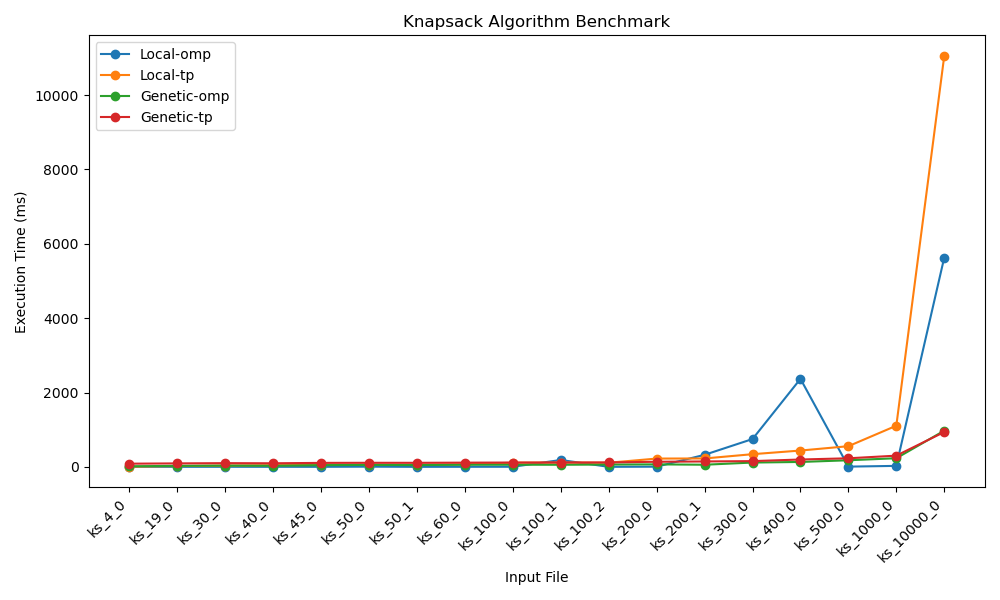

# Knapsack Algorithm Benchmark

This repository contains benchmark results for different implementations of the 0/1 Knapsack problem:

- **Local-omp**
- **Local-tp**
- **Genetic-omp**
- **Genetic-tp**

## Execution Time Comparison

## Detailed Results

| **File**   | **Local_omp**, Time (ms) | **Local_omp**, Value | **Local_tp**, Time (ms) | **Local_tp**, Value | **Genetic_omp**, Time (ms) | **Genetic_omp**, Value | **Genetic_tp** Time (ms) | **Genetic_tp**, Value |
|:-----------|-------------------------:|---------------------:|------------------------:|--------------------:|---------------------------:|-----------------------:|-------------------------:|----------------------:|
| ks_4_0     |                 0.006696 |                   19 |                  4.4055 |                  19 |                    14.4942 |                     19 |                  84.8974 |                    19 |
| ks_19_0    |                 0.141805 |                12248 |                 21.3074 |               12248 |                    26.5076 |                  12146 |                  92.6611 |                 12237 |
| ks_30_0    |                  1.18179 |                99798 |                 33.6175 |               99798 |                    33.8878 |                  99798 |                  99.3777 |                 99798 |
| ks_40_0    |                 0.797074 |                99924 |                  43.868 |               99924 |                    30.0039 |                  99924 |                  95.9173 |                 99924 |
| ks_45_0    |                 0.585087 |                23974 |                 50.2231 |               23974 |                    45.1575 |                  23321 |                  106.387 |                 23617 |
| ks_50_0    |                  4.73855 |               142156 |                 55.3374 |              142156 |                    52.7707 |                 141564 |                  108.718 |                141407 |
| ks_50_1    |                 0.108272 |                 5345 |                 55.3335 |                5345 |                    47.5472 |                   5156 |                  108.272 |                  5225 |
| ks_60_0    |                  1.15434 |                99837 |                 67.7294 |               99837 |                    55.9467 |                  99756 |                  112.734 |                 99837 |
| ks_100_0   |                  1.95715 |                99837 |                 111.483 |               99837 |                    57.2359 |                  99787 |                  115.532 |                 99793 |
| ks_100_1   |                  184.128 |          1.33393e+06 |                 114.426 |              303442 |                    55.5734 |            1.33227e+06 |                  116.733 |           1.33233e+06 |
| ks_100_2   |                 0.318164 |                10892 |                 110.483 |               10892 |                    61.8469 |                  10516 |                  118.629 |                 10540 |
| ks_200_0   |                  4.17675 |               100236 |                 222.599 |              100236 |                    66.4917 |                 100236 |                  136.464 |                100236 |
| ks_200_1   |                  323.829 |           1.1036e+06 |                 225.188 |         1.10336e+06 |                    56.7305 |            1.10061e+06 |                  144.661 |           1.10021e+06 |
| ks_300_0   |                  747.857 |          1.68869e+06 |                 340.462 |         1.68826e+06 |                    115.195 |            1.68342e+06 |                  153.909 |           1.68284e+06 |
| ks_400_0   |                  2367.49 |          3.96718e+06 |                 438.515 |              930645 |                    131.446 |            3.96235e+06 |                  197.319 |           3.96185e+06 |
| ks_500_0   |                  5.79002 |                54939 |                 555.463 |               54939 |                     176.88 |                  53074 |                  229.949 |                 52894 |
| ks_1000_0  |                  25.9308 |               109899 |                  1106.5 |              109899 |                    231.561 |                 106354 |                  301.221 |                106043 |
| ks_10000_0 |                  5631.22 |          1.09989e+06 |                 11056.8 |         1.09989e+06 |                    973.004 |               1.06e+06 |                  937.133 |           1.05893e+06 |
